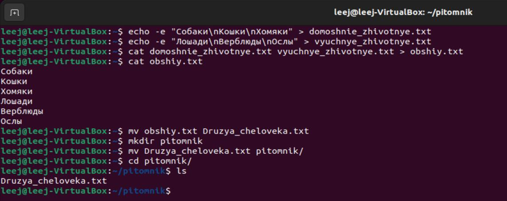
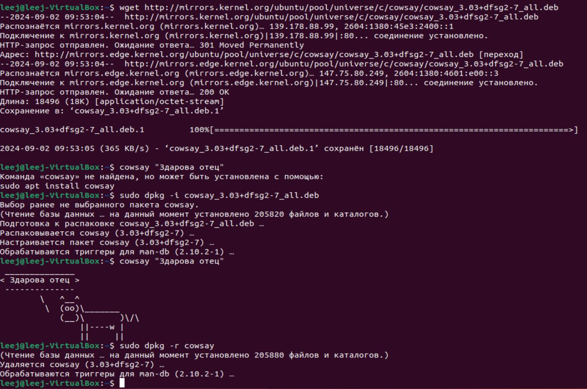
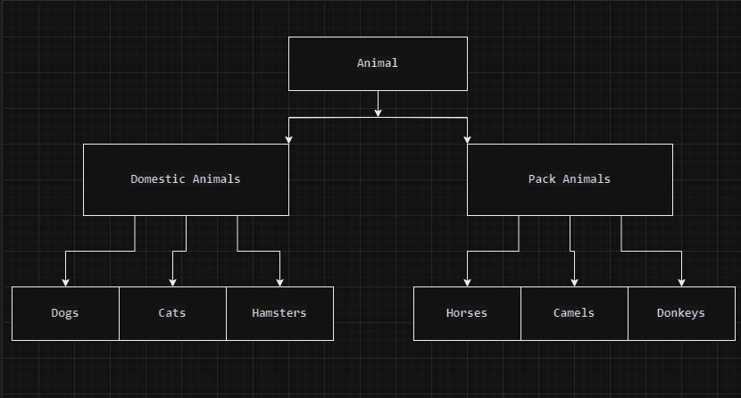

# Итоговая работа.


#### 1. Используя команду cat в терминале операционной системы Linux, создать два файла Домашние животные (заполнив файл собаками, кошками, хомяками) и Вьючные животными заполнив файл Лошадьми, верблюдами и ослы), а затем объединить их. Просмотреть содержимое созданного файла. Переименовать файл, дав ему новое имя (Друзья человека). 


#### 2. Создать директорию, переместить файл туда. 


#### 3. Подключить дополнительный репозиторий MySQL. Установить любой пакет из этого репозитория
```
sudo apt-get update (обновляем список пакетов)
wget https://repo.mysql.com//mysql-apt-config_0.8.24-1_all.deb (добавляем официальный ключ репозитория MySQL, чтобы Ubuntu доверяло загружаемым пакетам)
sudo dpkg -i mysql-apt-config_0.8.24-1_all.deb (устанавливаем загружаемый пакет)
sudo apt-key adv --keyserver keyserver.ubuntu.com --recv-keys B7B3B788A8D3785C (добавляем правильный GPG ключ)
sudo apt-get update (обновляем список пакетов)
sudo apt-get install mysql-server (устанавливаем пакет mysql server)
sudo systemctl status mysql (проверяем работоспособность)
```

#### 4. Установить и удалить deb-пакет с помощью dpkg 



#### 5.Выложить историю команд в терминале ubuntu
```
leej@leej-VirtualBox:~$ history > history_commands.txt
leej@leej-VirtualBox:~$ cat history_commands.txt 
    1  user root
    2  clear
    3  echo -e "Собаки\nКошки\nХомяки" > domoshnie_zhivotnye.txt
    4  echo -e "Лошади\nВерблюды\nОслы" > vyuchnye_zhivotnye.txt
    5  cat domoshnie_zhivotnye.txt vyuchnye_zhivotnye.txt > obshiy.txt
    6  cat obshiy.txt
    7  mv obshiy.txt Druzya_cheloveka.txt
    8  mkdir pitomnik
    9  mv Druzya_cheloveka.txt pitomnik/
   10  cd pitomnik/
   11  ls
   12  cd ..
   13  sudo add-apt-repository ppa:mysql-ubuntu/ppa
   14  clear
   15  sudo apt-get update
   16  wget https://repo.mysql.com//mysql-apt-config_0.8.24-1_all.deb
   17  sudo dpkg -i mysql-apt-config_0.8.24-1_all.deb
   18  sudo apt-get update
   19  sudo apt-key adv --keyserver keyserver.ubuntu.com --recv-keys B7B3B788A8D3785C
   20  sudo apt-get update
   21  sudo apt-get install mysql-server
   22  sudo systemctl status mysql
   23  wget http://mirrors.kernel.org/ubuntu/pool/universe/c/cowsay/cowsay_3.03+dfsg2-7_all.deb
   24  sudo dpkg -i cowsay_3.03+dfsg2-7_all.deb
   25  cowsay "Здарова отец"
   26  sudo dpkg -r cowsay
   27  history > history_commands.txt
```

#### 6. Нарисовать диаграмму, в которой есть класс родительский класс, домашние животные и вьючные животные, в составы которых в случае домашних животных войдут классы: собаки, кошки, хомяки, а в класс вьючные животные войдут: Лошади, верблюды и ослы).



#### 7. В подключенном MySQL репозитории создать базу данных “Друзья человека”
```
sudo mysql -u root -p (входим в mysql)
CREATE DATABASE `Друзья человека` CHARACTER SET utf8mb4 COLLATE utf8mb4_unicode_ci; (создаем базу данных)
```
#### 8. Создать таблицы с иерархией из диаграммы в БД
```
mysql> USE `Друзья человека`;
Database changed
mysql> CREATE TABLE Вьючные_животные (
    ->     id INT PRIMARY KEY AUTO_INCREMENT,
    ->     имя VARCHAR(100) NOT NULL,
    ->     описание TEXT
    -> );
Query OK, 0 rows affected (0,11 sec)

mysql> CREATE TABLE Домашние_животные (
    ->     id INT PRIMARY KEY AUTO_INCREMENT,
    ->     имя VARCHAR(100) NOT NULL,
    ->     описание TEXT
    -> );
Query OK, 0 rows affected (0,13 sec)

mysql> CREATE TABLE Лошади (
    ->     id INT PRIMARY KEY AUTO_INCREMENT,
    ->     вьючное_животное_id INT,
    ->     имя VARCHAR(100) NOT NULL,
    ->     масть VARCHAR(100),
    ->     дата_рождения DATE,
    ->     команды VARCHAR(255),
    ->     FOREIGN KEY (вьючное_животное_id) REFERENCES Вьючные_животные(id)
    -> );
Query OK, 0 rows affected (0,11 sec)

mysql> CREATE TABLE Собаки (
    ->     id INT PRIMARY KEY AUTO_INCREMENT,
    ->     домашнее_животное_id INT,
    ->     имя VARCHAR(100) NOT NULL,
    ->     порода VARCHAR(100),
    ->     дата_рождения DATE,
    ->     команды VARCHAR(255),
    ->     FOREIGN KEY (домашнее_животное_id) REFERENCES Домашние_животные(id)
    -> );
Query OK, 0 rows affected (0,13 sec)

mysql> CREATE TABLE Верблюды (
    ->     id INT PRIMARY KEY AUTO_INCREMENT,
    ->     вьючное_животное_id INT,
    ->     имя VARCHAR(100) NOT NULL,
    ->     вид VARCHAR(100),
    ->     дата_рождения DATE,
    ->     команды VARCHAR(255),
    ->     FOREIGN KEY (вьючное_животное_id) REFERENCES Вьючные_животные(id)
    -> );
Query OK, 0 rows affected (0,12 sec)

mysql> CREATE TABLE Ослы (
    ->     id INT PRIMARY KEY AUTO_INCREMENT,
    ->     вьючное_животное_id INT,
    ->     имя VARCHAR(100) NOT NULL,
    ->     масть VARCHAR(100),
    ->     дата_рождения DATE,
    ->     команды VARCHAR(255),
    ->     FOREIGN KEY (вьючное_животное_id) REFERENCES Вьючные_животные(id)
    -> );
Query OK, 0 rows affected (0,13 sec)

mysql> CREATE TABLE Кошки (
    ->     id INT PRIMARY KEY AUTO_INCREMENT,
    ->     домашнее_животное_id INT,
    ->     имя VARCHAR(100) NOT NULL,
    ->     порода VARCHAR(100),
    ->     дата_рождения DATE,
    ->     команды VARCHAR(255),
    ->     FOREIGN KEY (домашнее_животное_id) REFERENCES Домашние_животные(id)
    -> );
Query OK, 0 rows affected (0,13 sec)

mysql> CREATE TABLE Хомяки (
    ->     id INT PRIMARY KEY AUTO_INCREMENT,
    ->     домашнее_животное_id INT,
    ->     имя VARCHAR(100) NOT NULL,
    ->     вид VARCHAR(100),
    ->     дата_рождения DATE,
    ->     команды VARCHAR(255),
    ->     FOREIGN KEY (домашнее_животное_id) REFERENCES Домашние_животные(id)
    -> );
Query OK, 0 rows affected (0,11 sec)
```
#### 9. Заполнить низкоуровневые таблицы именами(животных), командами которые они выполняют и датами рождения
```
mysql> INSERT INTO Вьючные_животные (id, имя, описание) VALUES
    ->     (1, 'Буцефал', 'Описание для Буцефала'),
    ->     (2, 'Плотва', 'Описание для Плотвы'),
    ->     (3, 'Сахара', 'Описание для Сахары'),
    ->     (4, 'Мираж', 'Описание для Миража'),
    ->     (5, 'Кротыш', 'Описание для Кротыша'),
    ->     (6, 'Иа', 'Описание для Иа');
Query OK, 6 rows affected (0,05 sec)
Records: 6  Duplicates: 0  Warnings: 0

mysql> INSERT INTO Домашние_животные (id, имя, описание) VALUES
    ->     (1, 'Бобик', 'Описание для Бобика'),
    ->     (2, 'Рекс', 'Описание для Рекса'),
    ->     (3, 'Мурка', 'Описание для Мурки'),
    ->     (4, 'Барсик', 'Описание для Барсика'),
    ->     (5, 'Пушистик', 'Описание для Пушистика'),
    ->     (6, 'Снежок', 'Описание для Снежка');
Query OK, 6 rows affected (0,04 sec)
Records: 6  Duplicates: 0  Warnings: 0

mysql> INSERT INTO Лошади (вьючное_животное_id, имя, масть, дата_рождения, команды) VALUES 
    -> (1, 'Буцефал', 'Вороной', '2015-03-12', 'Галоп, Тренировка'),
    -> (2, 'Плотва', 'Гнедая', '2016-05-22', 'Рывок, Прыжок через препятствия');
Query OK, 2 rows affected (0,05 sec)
Records: 2  Duplicates: 0  Warnings: 0

mysql> INSERT INTO Собаки (домашнее_животное_id, имя, порода, дата_рождения, команды) VALUES
    -> (1, 'Бобик', 'Дворняга', '2018-06-15', 'Сидеть, Лежать'),
    -> (2, 'Рекс', 'Немецкая овчарка', '2017-11-10', 'Аппорт, Оставаться');
Query OK, 2 rows affected (0,04 sec)
Records: 2  Duplicates: 0  Warnings: 0

mysql> INSERT INTO Верблюды (вьючное_животное_id, имя, вид, дата_рождения, команды) VALUES 
    -> (1, 'Сахара', 'Двугорбый', '2014-02-25', 'Стоять, Сидеть'),
    -> (2, 'Мираж', 'Одногорбый', '2013-07-10', 'Идти, Ложиться');
Query OK, 2 rows affected (0,03 sec)
Records: 2  Duplicates: 0  Warnings: 0

mysql> INSERT INTO Ослы (вьючное_животное_id, имя, масть, дата_рождения, команды) VALUES
    -> (1, 'Кротыш', 'Серая', '2016-09-18', 'Идти, Стой'),
    -> (2, 'Иа', 'Коричневая', '2017-12-03', 'Назад, Сидеть');
Query OK, 2 rows affected (0,02 sec)
Records: 2  Duplicates: 0  Warnings: 0

mysql> INSERT INTO Кошки (домашнее_животное_id, имя, порода, дата_рождения, команды) VALUES
    -> (1, 'Мурка', 'Британская короткошерстная', '2019-08-15', 'Принести, Мяукать'),
    -> (2, 'Барсик', 'Сибирская', '2018-03-30', 'Лапу, Идти');
Query OK, 2 rows affected (0,03 sec)
Records: 2  Duplicates: 0  Warnings: 0

mysql> INSERT INTO Хомяки (домашнее_животное_id, имя, вид, дата_рождения, команды) VALUES
    -> (1, 'Пушистик', 'Джунгарский', '2020-01-01', 'Колесо, Грызть'),
    -> (2, 'Снежок', 'Сирийский', '2019-10-05', 'Рычать, Копать');
Query OK, 2 rows affected (0,06 sec)
Records: 2  Duplicates: 0  Warnings: 0
```
#### 10. Удалить из таблицы верблюдов, т.к. верблюдов решили перевезти в другой питомник на зимовку. Объединить таблицы лошади, и ослы в одну таблицу. 
```
mysql> DELETE FROM Верблюды;
Query OK, 2 rows affected (0,06 sec)

mysql> CREATE TABLE Лошади_и_Ослы (
    ->     id INT PRIMARY KEY AUTO_INCREMENT,
    ->     вьючное_животное_id INT,
    ->     имя VARCHAR(100) NOT NULL,
    ->     масть VARCHAR(100),
    ->     дата_рождения DATE,
    ->     команды TEXT,
    ->     тип VARCHAR(50),
    ->     FOREIGN KEY (вьючное_животное_id) REFERENCES Вьючные_животные(id)
    -> );
Query OK, 0 rows affected (0,16 sec)

mysql> INSERT INTO Лошади_и_Ослы (вьючное_животное_id, имя, масть, дата_рождения, команды, тип)
    -> SELECT вьючное_животное_id, имя, масть, дата_рождения, команды, 'Лошадь' AS тип
    -> FROM Лошади;
Query OK, 2 rows affected (0,04 sec)
Records: 2  Duplicates: 0  Warnings: 0

mysql> INSERT INTO Лошади_и_Ослы (вьючное_животное_id, имя, масть, дата_рождения, команды, тип)
    -> SELECT вьючное_животное_id, имя, масть, дата_рождения, команды, 'Осёл' AS тип
    -> FROM Ослы;
Query OK, 2 rows affected (0,02 sec)
Records: 2  Duplicates: 0  Warnings: 0

mysql> DROP TABLE Лошади;
Query OK, 0 rows affected (0,14 sec)

mysql> DROP TABLE Ослы;
Query OK, 0 rows affected (0,13 sec)
```
#### 11.Создать новую таблицу “молодые животные” в которую попадут все животные старше 1 года, но младше 3 лет и в отдельном столбце с точностью до месяца подсчитать возраст животных в новой таблице 


Создаем новую таблицу 
```
CREATE TABLE Молодые_животные (
    id INT PRIMARY KEY AUTO_INCREMENT,
    домашнее_или_вьючное_животное_id INT,
    имя VARCHAR(100) NOT NULL,
    масть VARCHAR(100),
    дата_рождения DATE,
    команды TEXT,
    тип VARCHAR(50),
    возраст_в_месяцах INT,
    FOREIGN KEY (домашнее_или_вьючное_животное_id) REFERENCES Лошади_и_Ослы(id)
        ON DELETE CASCADE
        ON UPDATE CASCADE
);
```

Наши внесенные ранее животные не попадут под критерий от 1 до 3х лет. Поэтому изменим даты рождения нескольких животных.
```
UPDATE Лошади_и_Ослы SET дата_рождения = '2022-09-01' WHERE имя = 'Буцефал'; 
UPDATE Лошади_и_Ослы SET дата_рождения = '2022-06-15' WHERE имя = 'Плотва';
```
Перемещение данных в таблицу "Молодые животные"
 ```
INSERT INTO Молодые_животные (домашнее_или_вьючное_животное_id, имя, масть, дата_рождения, команды, тип, возраст_в_месяцах)
SELECT 
    id,
    имя,
    масть,
    дата_рождения,
    команды,
    тип,
    TIMESTAMPDIFF(MONTH, дата_рождения, CURDATE()) AS возраст_в_месяцах
FROM 
    Лошади_и_Ослы
WHERE 
    TIMESTAMPDIFF(YEAR, дата_рождения, CURDATE()) >= 1 
    AND TIMESTAMPDIFF(YEAR, дата_рождения, CURDATE()) < 3;
```

Проверка результатов
```
SELECT * FROM Молодые_животные;
```


#### 12. Объединить все таблицы в одну, при этом сохраняя поля, указывающие на прошлую принадлежность к старым таблицам. 
Создаем новую таблицу
```
mysql> CREATE TABLE Все_животные (
    ->     id INT PRIMARY KEY AUTO_INCREMENT,
    ->     имя VARCHAR(100) NOT NULL,
    ->     масть VARCHAR(100),
    ->     дата_рождения DATE,
    ->     команды TEXT,
    ->     тип VARCHAR(50),
    ->     старое_таблице VARCHAR(50), -- Поле для указания предыдущей таблицы
    ->     возраст_в_месяцах INT
    -> );
Query OK, 0 rows affected (0,09 sec)
```
Добавляем все записи из имеющихся таблиц
```
mysql> INSERT INTO Все_животные (имя, масть, дата_рождения, команды, тип, старое_таблице, возраст_в_месяцах)
    -> SELECT 
    ->     имя,
    ->     масть,
    ->     дата_рождения,
    ->     команды,
    ->     тип,
    ->     'Лошади_и_Ослы' AS старое_таблице,
    ->     TIMESTAMPDIFF(MONTH, дата_рождения, CURDATE()) AS возраст_в_месяцах
    -> FROM Лошади_и_Ослы;
Query OK, 4 rows affected (0,05 sec)
Records: 4  Duplicates: 0  Warnings: 0

mysql> INSERT INTO Все_животные (имя, масть, дата_рождения, команды, тип, старое_таблице, возраст_в_месяцах)
    -> SELECT 
    ->     имя,
    ->     NULL AS масть,
    ->     NULL AS дата_рождения,
    ->     NULL AS команды,
    ->     NULL AS тип,
    ->     'Домашние_животные' AS старое_таблице,
    ->     NULL AS возраст_в_месяцах
    -> FROM Домашние_животные;
Query OK, 6 rows affected (0,05 sec)
Records: 6  Duplicates: 0  Warnings: 0

mysql> INSERT INTO Все_животные (имя, масть, дата_рождения, команды, тип, старое_таблице, возраст_в_месяцах)
    -> SELECT 
    ->     имя,
    ->     NULL AS масть,
    ->     NULL AS дата_рождения,
    ->     NULL AS команды,
    ->     NULL AS тип,
    ->     'Вьючные_животные' AS старое_таблице,
    ->     NULL AS возраст_в_месяцах
    -> FROM Вьючные_животные;
Query OK, 6 rows affected (0,10 sec)
Records: 6  Duplicates: 0  Warnings: 0

mysql> INSERT INTO Все_животные (имя, масть, дата_рождения, команды, тип, старое_таблице, возраст_в_месяцах)
    -> SELECT 
    ->     имя,
    ->     масть,
    ->     дата_рождения,
    ->     команды,
    ->     тип,
    ->     'Молодые_животные' AS старое_таблице,
    ->     возраст_в_месяцах
    -> FROM Молодые_животные;
Query OK, 2 rows affected (0,02 sec)
Records: 2  Duplicates: 0  Warnings: 0
```
Проверяем результат
```
mysql> SELECT * FROM Все_животные;
```

Дополнительно удалим из таблицы повторяющиеся записи

Для этого, создадим временную таблицу и переместим в нее уникальные записи (по имени)
```
mysql> CREATE TEMPORARY TABLE Уникальные_животные AS
    -> SELECT * 
    -> FROM Все_животные
    -> WHERE id IN (
    ->     SELECT MIN(id)
    ->     FROM Все_животные
    ->     GROUP BY имя
    -> );
Query OK, 12 rows affected (0,01 sec)
Records: 12  Duplicates: 0  Warnings: 0
```
Очистим таблицу Все_животные
```
mysql> TRUNCATE TABLE Все_животные;
Query OK, 0 rows affected (0,14 sec)
```
Переместим из временной таблицы данные в таблицу все_животные
```
mysql> INSERT INTO Все_животные
    -> SELECT * FROM Уникальные_животные;
Query OK, 12 rows affected (0,06 sec)
Records: 12  Duplicates: 0  Warnings: 0
```
Удалим временную таблицу
```
mysql> DROP TEMPORARY TABLE Уникальные_животные;
Query OK, 0 rows affected (0,00 sec)
```
Результат - 12 записей


